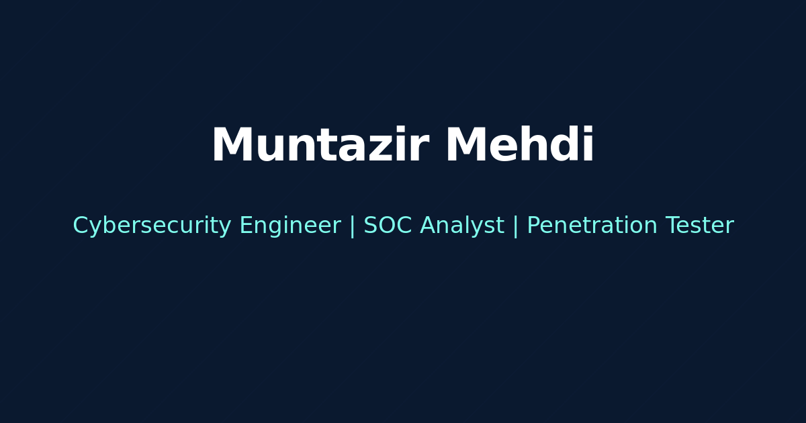

# Muntazir's Portfolio

<div align="center">
  
  
  
  
  
  
</div>

## 🌟 Overview

A modern, responsive portfolio website showcasing my professional work, skills, and experience. Built with cutting-edge technologies and designed with a focus on user experience and performance.

## ✨ Features

- 🎨 Modern and clean design
- 📱 Fully responsive layout
- 🚀 Fast loading with Vite
- 💻 Interactive UI components
- 🌈 Dynamic animations and transitions
- 🛠️ Built with TypeScript for type safety

## 🛠️ Tech Stack

- **Frontend Framework:** React
- **Build Tool:** Vite
- **Styling:** Tailwind CSS
- **UI Components:** shadcn/ui
- **Language:** TypeScript

## 🚀 Getting Started

### Prerequisites

- Node.js (v14 or higher)
- npm or yarn

### Installation

1. Clone the repository
```bash
git clone <repository-url>
```

2. Navigate to the project directory
```bash
cd portfolio
```

3. Install dependencies
```bash
npm install
# or
yarn
```

4. Start the development server
```bash
npm run dev
# or
yarn dev
```

The application will be available at `http://localhost:8080`

## 🌐 Deployment

This project can be easily deployed using various platforms:

### Custom Domain Deployment

While Lovable doesn't currently support custom domains, you can deploy this project on Netlify:

1. Fork this repository
2. Connect your Netlify account
3. Deploy with your custom domain

## 💡 Development

### Project Structure

```
src/
├── components/     # Reusable UI components
├── pages/         # Page components
├── utils/         # Utility functions
├── hooks/         # Custom React hooks
└── App.tsx        # Main application component
```

### Key Features

- **Type Safety**: Utilizing TypeScript for better development experience
- **Component Library**: Built with shadcn/ui for consistent UI
- **Responsive Design**: Fully responsive on all devices
- **Performance**: Optimized for fast loading and smooth interactions

## 📫 Contact

Feel free to reach out if you have any questions or would like to connect!

- LinkedIn: muntazir-security
- Email: info@muntazirmehdi.com
- Portfolio: www.muntazirmehdi.com

## 📄 License

This project is licensed under the MIT License - see the [LICENSE](LICENSE) file for details.

---

<div align="center">
  Made with ❤️ 
</div>
